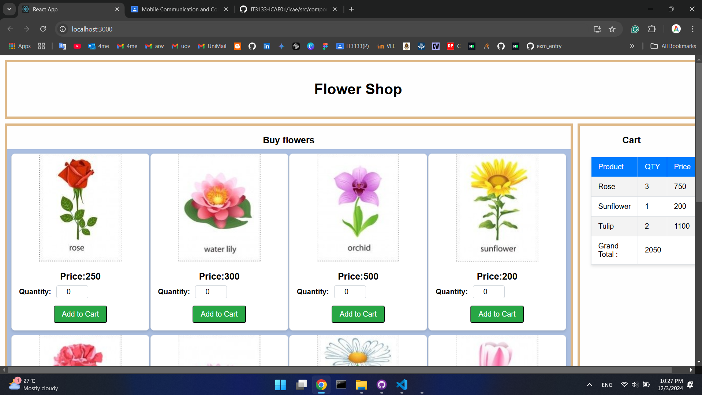

# IT3133-ICAE01
 
## 2020ICT101
### IT3133-ICAE01

You are requested to develop the front end of an online flower shop e-commerce application.
For the initial step, you must complete the given task with efficient programming methods
and component architecture.
1. On the left side, display the flowers, their image, name, and price.
2. The buyer should able to enter the quantity of flower needed and add it to the cart.
3. On the right side, display a shopping cart table which contains the flower name,
quantity, the total price of each flower and finally the total of the whole purchase.

### Output
